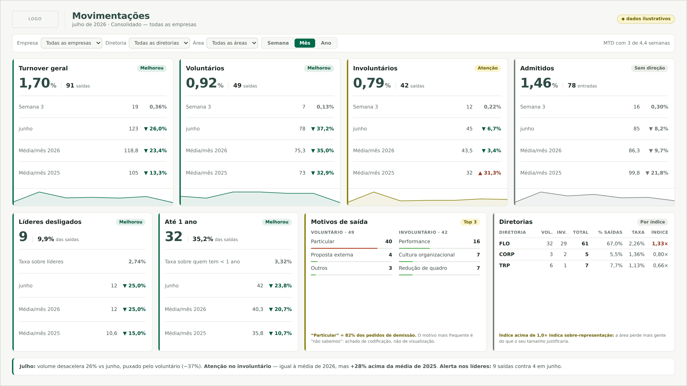

# Farol de KPIs de RH — documento de transferência

Documento único de contexto para retomar o desenvolvimento em outra conversa ou
com outra pessoa. Contém o problema, o que já existe, a identidade visual com
contrastes medidos, o modelo de dados, todas as fórmulas, os dados reais e sua
procedência, as decisões tomadas e por quê, as armadilhas encontradas, e o que
ficou em aberto.

**Para quem carregar isto num chat novo:** leia as seções 1 a 3 para o contexto,
5 a 7 para poder mexer no código sem quebrar nada, e 10 e 11 antes de propor
qualquer coisa — metade das ideias óbvias já foi testada e descartada por um
motivo.

---

## 1. O problema

O responsável por Analytics de RH apresenta semanalmente ao comitê os dados que
movimentaram a semana e o acumulado do mês. A apresentação atual tem entre 25 e
40 slides e é pouco produtiva.

A causa não é excesso de informação. É **repetição**: a maior parte dos slides é
o mesmo indicador em outra janela de tempo ou em outra quebra organizacional. Um
deck típico dedica cinco slides a turnover — mês, acumulado do ano, série de 12
meses, comparativo com ano anterior, e um por diretoria.

O que se quer no lugar:

- formato de farol, curto, estratégico
- comparação com outros períodos do ano e com o ano anterior
- comentários de motivos e análises junto do número
- web, abrindo em tablet e celular
- filtro por área, diretoria, empresa
- enquanto a empresa se adapta, precisa colar bem num PPT

---

## 2. Estado atual

Duas frentes, ambas funcionais.

**Frente A — farol genérico de 12 KPIs de RH** (`index.html`). Painel completo
com motor de dados próprio, filtros, janelas semana/mês/ano, análise por cartão,
resumo executivo e impressão. Dados sintéticos. Serviu para validar a visão
inteira. **Está pausada** — o trabalho migrou para a frente B.

**Frente B — tela a tela, a partir dos slides reais.** Em andamento. A primeira
tela ("Informações Quadro – Desligados", agora "Movimentações") está pronta em
duas versões:

| Arquivo | Base | Filtros | Estado |
|---|---|---|---|
| `painel/movimentacoes.html` | `modelo-semanal.xlsx` (um recorte agregado) | não | funcional |
| `painel/movimentacoes-filtros.html` | `base-movimentacoes.xlsx` (fatos por segmento) | **sim** | funcional, é a recomendada |

Publicação definida: **arquivo HTML único em pasta de rede**. Sem servidor, sem
biblioteca externa, sem chamada de rede. Abre por duplo clique.

Qlik Sense foi avaliado e **adiado** — ver seção 11.

---

## 3. Inventário de arquivos

```
painel/movimentacoes-filtros.html   painel com filtros, base embutida        ← principal
painel/movimentacoes.html           painel sem filtros, recorte único
base-movimentacoes.xlsx             base por segmento (Fatos, Motivos, Config, Textos)
modelo-semanal.xlsx                 planilha do painel sem filtros
tools/criar-base-filtros.py         gera base-movimentacoes.xlsx
tools/criar-modelo-semanal.py       gera modelo-semanal.xlsx
docs/mockups/movimentacoes.html     modelo visual escuro, primeira proposta (histórico)
docs/imagens/*.png                  prints de referência do painel real (ver §4.0)
tools/render-docs.mjs               regera os prints de referência (Playwright)

--- frente A, pausada ---
index.html                          farol de 12 KPIs, motor completo
dados.json                          dados sintéticos (1.148 fatos semanais, 82 semanas)
tools/gerar-dados.mjs               gera dados.json e reinjeta em index.html
tools/apurar.mjs                    apura os mesmos KPIs no terminal, para conferir com o BI
tools/gerar-artifact.mjs            extrai versão para hospedar
docs/MODELO-DE-DADOS.md             contrato de dados da frente A
docs/TELA-A-TELA.md                 método de migração slide → tela
inventario-indicadores.xlsx         formulário de inventário de indicadores
tools/criar-inventario.py           gera o inventário
tools/importar-inventario.py        lê o inventário preenchido e emite definições de KPI
```

Nada tem dependência de rede. Nenhum arquivo busca CDN, fonte externa ou API.

---

## 4. A tela: layout

### 4.0 Imagens de referência

Renderizadas do arquivo real, não são mockups. Ficam em `docs/imagens/`.

| Arquivo | O que mostra |
|---|---|
| `docs/imagens/01-consolidado.png` | painel com filtros, sem recorte, janela Mês — **o estado de referência** |
| `docs/imagens/02-filtro-diretoria.png` | o mesmo painel com a diretoria FLO selecionada; note que a quebra do último cartão desceu para áreas |
| `docs/imagens/03-mobile.png` | 390 px de largura, cartões empilhados, sem transbordo horizontal |
| `docs/imagens/04-sem-filtros.png` | a versão `painel/movimentacoes.html`, sem filtros |



Ao comparar qualquer alteração futura, gere o print de novo e compare com
`01-consolidado.png`. O script está em §12.5.

### 4.1 Estrutura

Bloco `.slide` com proporção **16:9 exata**, medida em 1600×900. Um print dele
entra num slide de PPT sem sobra.

```
┌──────────────────────────────────────────────────────────────────────────────┐
│ [LOGO] │ Movimentações                                    ◆ dados ilustrativos│
│        │ julho de 2026 · Consolidado — todas as empresas                      │
├──────────────────────────────────────────────────────────────────────────────┤
│ Empresa [▾] Diretoria [▾] Área [▾]  │Semana│ Mês │Ano│  Limpar   MTD 3/4,4 sem│
├──────────────┬──────────────┬──────────────┬─────────────────────────────────┤
│ Turnover     │ Voluntários  │ Involuntários│ Admitidos                       │
│ geral        │              │              │                                 │
│ ┌ Melhorou   │ ┌ Melhorou   │ ┌ Atenção    │ ┌ Sem direção                   │
│ 1,70% │ 91   │ 0,92% │ 49   │ 0,79% │ 42   │ 1,46% │ 78                      │
│ ─────────────│ ─────────────│ ─────────────│ ─────────────                   │
│ Semana 3  19 │ Semana 3   7 │ Semana 3  12 │ Semana 3   8                    │
│ junho    123 │ junho     78 │ junho     45 │ junho     85                    │
│ Méd/mês26 119│ Méd/mês26 75 │ Méd/mês26 44 │ Méd/mês26 85                    │
│ Méd/mês25 105│ Méd/mês25 75 │ Méd/mês25 33 │ Méd/mês25 —                     │
│ ~~~ sparkline│ ~~~ sparkline│ ~~~ sparkline│ ~~~ sparkline                   │
├──────────────┼──────────────┼──────────────┴─────────┬───────────────────────┤
│ Líderes      │ Até 1 ano    │ Motivos de saída       │ Diretorias            │
│ desligados   │              │ VOLUNT.·49 INVOLUNT.·42│ dir vol inv tot % tx ×│
│ 9 │ 9,9%     │ 32 │ 35,2%   │ Particular 40 Perform 16│ FLO 32 29 61 67% ..  │
│ Taxa   2,74% │ Taxa  3,32%  │ Proposta    4 Cultura 7│ ...                   │
│ junho      4 │ junho     29 │ Mudança     2 Redução 7│                       │
│ Méd/mês26 5,8│ ...          │ nota                   │ nota                  │
├──────────────┴──────────────┴────────────────────────┴───────────────────────┤
│ ▌ Julho: volume desacelera 26% vs junho... (editável na tela)                │
└──────────────────────────────────────────────────────────────────────────────┘
```

Fora do slide, e portanto fora do print, fica a barra de ferramentas:
`Atualizar dados` · `Trocar logo` · `Imprimir / PDF` · `Salvar semana`.

**Como o 16:9 se sustenta.** O `.slide` tem `container-type: inline-size` e
`aspect-ratio: 16/9`. Todas as medidas internas estão em `cqw` (percentual da
largura do container), então a tela escala como uma peça só em qualquer
resolução. As duas faixas de cartões usam `flex: 1.06` e `flex: 1` para repartir
a altura livre — sem isso sobrava vazio no rodapé.

Abaixo de 900px o `aspect-ratio` é desligado, `container-type` volta a `normal`,
as medidas voltam para pixels e os cartões empilham. Verificado sem transbordo
horizontal a 390px.

---

## 5. Identidade visual

### 5.1 Paleta institucional

Extraída do manual de marca enviado pelo cliente (leitura visual do print —
**confirmar os hex exatos com o manual oficial**).

```
Primárias
  verde escuro   #2E4C46      verde institucional #00694A
  verde claro    #5FB35A      amarelo             #D6C500
  verde palha    #DCE6A6

Secundárias
  oliva  #8CB63F   bege      #E8DAC4   rosa claro #F2CFE0
  musgo  #7D8C4C   ocre      #CC9433   rosa       #EE6D8E
  menta  #63C0A2   terracota #C56C33   lilás      #9B77C0
  azul   #1C6D96   tijolo    #B54728   roxo       #6C3F97
```

### 5.2 Superfícies e tinta

```css
--papel:     #F7F8F5    fundo do slide
--cartao:    #FFFFFF    fundo dos cartões
--fio:       #E3E7E0    divisórias
--fio-forte: #CBD2CA    bordas de controle
--tinta:     #1E2A26    texto principal   13,93:1
--tinta-2:   #4A5751    texto secundário   7,10:1
--tinta-3:   #6E7873    rótulos            4,29:1
```

### 5.3 O farol, e a decisão que a paleta impôs

**O amarelo institucional `#D6C500` tem 1,66:1 sobre o papel.** Não enxerga.
Num farol isso é grave, porque amarelo é exatamente o estado que pede atenção.

A solução separa os papéis dentro da mesma família de cor: o amarelo puro só
aparece como **preenchimento de chip**, com texto escuro por cima; a **marca**
(faixa lateral do cartão, linha de tendência) usa o mesmo amarelo escurecido até
passar de 3:1.

```
estado    marca      contraste   chip       texto      contraste
bom       #00694A    6,32:1      #E4F0EA    #00563C    7,49:1
atenção   #877C00    4,01:1      #FAF4D0    #6E6400    5,43:1
crítico   #B54728    5,06:1      #F7E7E1    #8E3720    6,43:1
neutro    #6E7873    4,29:1      #EDEFEA    #5A6560    5,23:1
```

Escurecimentos testados do amarelo, para registro: `#BFB000` 2,09 · `#A89B00`
2,68 · `#948800` 3,41 · **`#877C00` 4,01** · `#7A7000` 4,75.

**Regra geral:** cor de status nunca carrega significado sozinha. Todo chip traz
a palavra ("Melhorou", "Atenção", "Piorou", "Sem direção") e todo cartão traz a
faixa lateral, que é forma além de cor.

### 5.4 Tipografia

Cinco tamanhos, e só cinco. Foi o que resolveu a sensação de bagunça — a versão
anterior usava dez. Verificado no DOM renderizado.

| Papel | 1600px | em cqw |
|---|---|---|
| Número principal | 32px | 2cqw |
| Título da tela | 20px | 1,35cqw |
| Título do cartão, unidade, número secundário | 14px | 0,9cqw |
| Corpo — rótulos e valores | 12px | 0,75cqw |
| Micro — chips, notas | 10,5px | 0,66cqw |

Fonte: `"Segoe UI", ui-sans-serif, system-ui, -apple-system, Roboto, Arial`.
Nenhuma webfont — o arquivo não pode buscar nada fora.

`font-variant-numeric: tabular-nums` em toda coluna de número que se alinha
verticalmente. Nunca no número principal — largura fixa deixa `121` frouxo em
corpo grande.

### 5.5 O que foi tirado, e por quê

- **Rótulos de grupo** ("CONSOLIDADO", "SUBGRUPO"): o título do cartão já diz.
- **Legenda de farol no topo**: os chips já trazem a palavra.
- **Frases sob o número** ("desligados no mês", "por decisão da empresa"):
  explicação que a audiência executiva não precisa.
- **Rótulo sobre o sparkline**: a linha é contexto, não leitura precisa.

Tema escuro foi a primeira proposta (`docs/mockups/movimentacoes.html`) e foi
**abandonado**: o print precisa entrar num deck branco sem virar caixa preta.

---

## 6. Modelo de dados

### 6.1 O princípio

O painel **não guarda indicadores prontos**. Guarda os componentes brutos, e
calcula na hora.

Se a base trouxesse "turnover = 2,1%" por área, o consolidado seria a média das
médias, que ignora o tamanho de cada área e está errado. Guardando
desligamentos e headcount separados, qualquer recorte fecha certo:

> **filtra → soma → só então divide**

### 6.2 `base-movimentacoes.xlsx` — a base com filtros

**Aba `Fatos`** — uma linha por segmento por período. É o coração.

| Coluna | O que é | Tipo |
|---|---|---|
| `empresa`, `diretoria`, `area` | os três níveis do filtro | dimensão |
| `periodo` | `AAAA-MM` para mês, `AAAA-MM-Sn` para semana | dimensão |
| `hc` | headcount médio do segmento no período | **estoque** |
| `hc_lideres` | posições de liderança existentes | **estoque** |
| `hc_ate1ano` | pessoas com menos de 1 ano de casa | **estoque** |
| `admitidos` | entradas | fluxo |
| `desl_vol` | desligamentos a pedido | fluxo |
| `desl_inv` | desligamentos por decisão da empresa | fluxo |
| `desl_lideres` | desligados que eram líderes | fluxo |
| `desl_ate1ano` | desligados com menos de 1 ano | fluxo |

**Não existe coluna de total.** `desl_total = desl_vol + desl_inv`, calculado.

`desl_lideres` e `desl_ate1ano` são **recortes sobrepostos** dos desligados — um
líder pode ter menos de um ano. Não somam com nada e não formam partição.

**Aba `Motivos`** — `empresa`, `diretoria`, `area`, `periodo`, `familia`,
`motivo`, `qtd`. Uma linha por motivo por segmento.

**Aba `Config`** — chave/valor: `titulo`, `periodo_atual`, `semana_atual`,
`periodo_rotulo`, `semana_rotulo`, `regua`, `janela_padrao`, `dados_exemplo`.

**Aba `Textos`** — `insight`, `nota_motivos`, `nota_diretorias`. Use `**assim**`
para negrito; o painel converte e devolve no mesmo formato quando editado na
tela.

**Aba `Conferência`** — 12 fórmulas `SUMIFS` que acusam soma que não fecha antes
da publicação.

Volume atual do exemplo: 154 linhas de fato, 7 segmentos, 22 períodos (19 meses
e 3 semanas), 37 linhas de motivo.

### 6.3 `modelo-semanal.xlsx` — a base sem filtros

Formato de blocos marcados por `#NOME` na coluna A: `#META`, `#KPI`, `#SERIE`,
`#PERFIL`, `#MOTIVOS`, `#DIRETORIAS`, `#TEXTO`. Traz o indicador já calculado
para um recorte. Mantida para quem só precisa do consolidado.

---

## 7. Lógica e fórmulas

### 7.1 Fluxo x estoque — a distinção que faz os números fecharem

| | Entre segmentos | Ao longo do tempo |
|---|---|---|
| **Fluxo** (admissões, desligamentos) | soma | soma |
| **Estoque** (headcount) | soma | **média** |

Headcount não se acumula: 100 pessoas em janeiro e 100 em fevereiro são as
mesmas 100 pessoas, não 200.

```js
// modo "soma"  → total do intervalo   (uso: mês, acumulado do ano)
// modo "media" → média por período    (uso: média mensal do ano)
// estoque tira média no tempo em AMBOS os modos
for (const k of FLUXOS)   r[k] = modo === "media" ? soma / n : soma;
for (const k of ESTOQUES) r[k] = soma / n;
```

**Armadilha relacionada.** O *comportamento do indicador* e o *tipo do
componente* são perguntas diferentes. Absenteísmo é uma taxa que independe do
tamanho do período, mas é formada por horas, que são fluxo e somam. Confundir os
dois produz acumulado de mês errado — foi um bug real, ver seção 10.

### 7.2 As quatro taxas

```
taxa do indicador   = valor           / hc          × 100
composição          = recorte         / desl_total  × 100   ("9,9% das saídas")
incidência          = recorte         / hc_recorte  × 100   ("liderança gira a 2,74%")
índice de sobre-rep = (saídas_g / saídas_total) / (hc_g / hc_total)
```

**Composição x incidência é a distinção mais importante da tela.** "9 líderes
saíram, 9,9% das saídas" não diz se é grave. "A liderança gira a 2,74% contra
1,70% do grupo" diz. Só a incidência tem direção de melhora — a composição sobe
quando líderes saem mais *ou* quando não-líderes saem menos, e a seta fica
ambígua.

**O índice resolve a mesma armadilha na quebra por diretoria.** FLO tem 67% das
saídas — mas tem 50% do quadro. Índice 1,33×: perde 33% mais gente do que o
tamanho justificaria. Sem ele, o ranking é de tamanho e mostra a mesma diretoria
todo mês. Acima de 1,0× o painel pinta o valor de vermelho.

### 7.3 Variação

```js
dif = valor - base
magnitude = |dif / base| × 100, formatada com 1 casa
nulo = magnitude arredondada == 0        → texto "estável", sem seta
sentido: direcao "menor" → bom se dif < 0
         direcao "maior" → bom se dif > 0
         direcao vazia   → neutro (não se julga)
```

O teste de nulidade usa a magnitude **já arredondada**. Sem isso a tela mostra
"−0 pts" para diferenças invisíveis.

### 7.4 O farol

Regra automática, explicável em uma frase: **conta quantas comparações
disponíveis estão piores.**

```
nenhuma pior            → verde
até metade das válidas  → amarelo
mais da metade          → vermelho
sem direção declarada   → cinza
comparação sem dado não entra na conta
```

Validação: rodando contra os dados reais, a regra chegou aos mesmos estados que
tinham sido atribuídos manualmente nos rascunhos.

Exemplos com os dados de julho:
- Turnover: 3 comparações, 0 piores → **verde**
- Involuntário: 3 comparações, 1 pior (média 2025) → **amarelo**
- Líderes: 1 comparação disponível, 1 pior → **vermelho**
- Admitidos: sem direção declarada → **cinza**

**Farol de meta e farol de tendência são coisas diferentes** e podem se
contradizer: um indicador pode estar piorando e ainda assim dentro da meta. Como
ainda não há metas definidas, o painel usa **tendência** e declara isso. Quando
as metas chegarem, o chip vira farol de meta e a tendência fica só nas setas.

### 7.5 As janelas de leitura

Só entram comparações que a base sustenta. O resto aparece como "sem dado".

**Mês (MTD)** — valor: o mês de referência
```
Semana N          semana de referência, com taxa (informativa)
{mês anterior}    comparação
Média/mês {ano}   média dos meses FECHADOS do ano — o mês em curso não entra
Média/mês {ano-1} média dos meses do ano anterior
```

**Ano (YTD)** — valor: soma dos meses do ano
```
jan–{mês} {ano-1}  mesmos meses do ano anterior — a única comparação verdadeira
Média/mês {ano}    informativa, sem seta
{ano-1} fechado    informativa, sem seta
```

**Semana** — valor: a semana de referência
```
Semana anterior            comparação
Média/sem em {mês}         comparação
Semana em {ano-1}          sem dado (não há semanas do ano anterior na base)
```

### 7.6 Período comparável

Princípio que atravessa o projeto: **todo comparativo usa o mesmo número de
períodos decorridos.**

O slide original comparava 91 (3 semanas de julho) com 123 (junho inteiro) e
concluía −26%. Boa parte desses −26% é só o mês não ter acabado. Levando julho a
run-rate e comparando com a média mensal de 2026, julho não está 26% abaixo:
está cerca de **11% acima**. O sinal inverte, e é o número que vai ao comitê.

Por isso a média mensal do ano corrente usa **só meses fechados**, e a tira de
contexto declara `MTD com 3 de 4,4 semanas`.

### 7.7 Leitura do `.xlsx` no navegador

Um `.xlsx` é um ZIP de XMLs. O painel abre na unha, sem biblioteca externa,
porque o arquivo precisa rodar de pasta de rede sem buscar nada fora:

1. varre o fim do arquivo procurando a assinatura `0x06054b50` (EOCD)
2. lê o índice central: nome, método de compressão, tamanho e offset de cada
   entrada
3. descomprime com `DecompressionStream("deflate-raw")` — nativo do navegador
4. `DOMParser` no XML

Resolve a aba pelo `xl/workbook.xml` mais o `xl/_rels/workbook.xml.rels`, e
aceita **os dois formatos de texto**: `sharedStrings` (como o Excel salva) e
`inlineStr` (como o openpyxl escreve). O `Target` do rel pode vir absoluto
(`/xl/worksheets/sheet2.xml`) ou relativo.

**Leitura de número tolerante a locale:**
```js
com vírgula → o ponto é milhar:  "1.234,5" → 1234.5
sem vírgula → o ponto só é milhar quando separa exatamente 3 dígitos:
              "1.70"  → 1.7      (decimal en-US preservado)
              "1.234" → 1234     (milhar pt-BR)
```

### 7.8 Salvar semana

Clona o `documentElement`, reescreve o bloco `<script id="base">` com o objeto
atual (incluindo textos editados e a logo em data URI), fecha o painel de dados
e baixa como `movimentacoes-202607.html`.

O arquivo salvo leva a **base inteira** dentro, então os filtros continuam
funcionando para quem abrir na pasta de rede. Cada semana vira um arquivo, o que
transforma o histórico em registro do que foi apresentado e comentado.

---

## 8. Os dados reais e sua procedência

### 8.1 Reconstruído do slide original — tudo fecha

**Quebra por diretoria em julho/2026**, extraída da tabela "Detalhado"
(líder/não-líder × voluntário/involuntário):

| Diretoria | Vol | Inv | Total | Líderes |
|---|---|---|---|---|
| FLO | 32 | 29 | 61 | 4 |
| IND | 6 | 6 | 12 | 1 |
| TRP | 6 | 1 | 7 | 0 |
| LOG | 2 | 4 | 6 | 3 |
| CORP | 3 | 2 | 5 | 1 |
| **Total** | **49** | **42** | **91** | **9** |

Fecha com os quatro números impressos no slide: 49, 42, 91 e "Líder 9".

**Série mensal de 2026**, reconstruída do gráfico de evolução e validada por
três caminhos independentes:

| | jan | fev | mar | abr | mai | jun | jul | soma | YTD impresso |
|---|---|---|---|---|---|---|---|---|---|
| Total | 93 | 147 | 116 | 119 | 115 | 123 | 91 | **804** | 804 ✓ |
| Voluntário | 69 | 63 | 82 | 82 | 78 | 78 | 49 | **501** | 501 ✓ |
| Involuntário | 24 | 84 | 34 | 37 | 37 | 45 | 42 | **303** | 303 ✓ |

Cada série soma o YTD impresso, voluntário + involuntário fecha o total em todos
os meses, e a média dos seis meses fechados dá 118,8 — o "119" da planilha do
cliente.

**Semanas de julho:** S1 (19 vol / 14 inv), S2 (23/16), S3 (7/12). Somam 49 e 42.

**Motivos de julho:** Particular 40, Performance 16, Cultura Organizacional 7,
Redução de quadro 7, Excesso de faltas 6, Proposta de trabalho 4, Violação de
procedimentos 3, Mudança de cidade 2, Proposta de trabalho 2, Reestruturação 2.

A separação por família fecha: voluntários = Particular 40 + Proposta 4 +
Mudança 2 + Proposta 2 + 1 outro = 49; involuntários = os demais = 42.

**Outros números do cliente:** YTD 2025 = 751 (522 vol / 229 inv) · média mensal
2026 = 119 · média mensal 2025 = 105 · junho = 123 (78/45) · admitidos julho 78,
junho 85 · líderes junho 4 · até 1 ano 32 (35%) · taxa de turnover julho 1,70%.

### 8.2 Derivado para fechar com os totais impressos

**Série mensal de 2025.** Montada para somar 751 até julho e 1.260 no ano — que
é a média de 105 informada. Os rótulos que consegui ler do gráfico LY não batiam
com o YTD impresso, e o número impresso é mais confiável que a leitura da linha.

```
73, 96, 142, 128, 119, 98, 95, 87, 105, 87, 99, 131
```

**Distribuição por segmento nos meses anteriores.** Replica a proporção de
julho. Substituir pela real.

### 8.3 Ilustrativo — precisa ser substituído

- **headcount por segmento** (total 5.348, derivado da taxa de 1,70% com 91
  saídas). Sustenta todas as taxas. **É o dado que mais falta.**
- **headcount de liderança** (329) e **de quem tem menos de 1 ano** (963)
- **subdivisão em áreas** (Colheita/Silvicultura para FLO, Produção/Manutenção
  para IND)

Enquanto `dados_exemplo = sim` no Config, o painel mostra o selo "dados
ilustrativos".

**Inconsistência a resolver:** a taxa de 1,70% com 91 saídas implica um HC de
cerca de 5.350. Um dos cards enviados pelo cliente dizia "1.245 HC ativos". Um
dos dois é de outro conjunto de dados.

### 8.4 Validação forte

Com a janela em **Ano**, o painel produz sozinho, agregando os fatos brutos:
involuntário **+32%** e voluntário **−4%** no acumulado de 2026.

É exatamente o texto escrito no rodapé do slide original. O motor chegou lá pela
agregação, sem esses números terem sido codificados.

---

## 9. Decisões de projeto

| Decisão | Por quê |
|---|---|
| Componentes brutos, não métricas prontas | filtrar sem produzir média de médias |
| Arquivo HTML único, zero dependência | passa em ambiente restrito, roda de pasta de rede |
| 16:9 e tema claro | o print entra num deck branco sem virar caixa preta |
| Cinco tamanhos de fonte | o que resolveu a sensação de bagunça |
| Farol por contagem de comparações piores | explicável em uma frase, e bateu com o julgamento manual |
| "Sem dado" em vez de zero | zero é uma afirmação; vazio é a verdade |
| Sem direção declarada → cinza | seta apontando para o lado errado é pior que seta nenhuma |
| Média mensal só de meses fechados | o mês em curso contamina a média |
| Índice de sobre-representação | ranking por volume é ranking de tamanho, não de risco |
| Motivos separados por família | "por que nos deixam" e "por que desligamos" são conversas diferentes |
| Total da família vem do KPI | a soma do top 3 não cobre o universo |
| Marca de procedência no insight | texto do consolidado sob filtro vira mentira |
| Quebra desce um nível com o filtro | dentro de FLO, mostrar as áreas de FLO |
| Cada semana vira um arquivo | o histórico vira registro do que foi dito |

**Descartado:** tema escuro (não cola no deck) · tabela densa com DELTA/%VAR/
FAROL/ANÁLISE em linhas separadas (20 linhas por indicador; colapsado para 1) ·
filtros decorativos (removidos e depois construídos de verdade) · leitura de
`.xlsx` por biblioteca externa (quebra a regra de zero dependência).

---

## 10. Armadilhas encontradas

Cada uma foi um bug real. Vale conhecer antes de mexer.

**Semana ISO 53 inexistente.** `Math.round` em vez de `Math.floor` no cálculo de
semanas do ano criava uma semana 53 em 2025 cuja segunda-feira era, na verdade,
a semana 1 de 2026 — período duplicado.

**Comportamento do indicador confundido com tipo do componente.** O importador
usava `escala` do KPI para decidir se somava ou pegava o último valor dos
componentes. Absenteísmo é taxa que independe do período (escala instante), mas
soma horas (componente fluxo). Resultado: acumulado de mês errado. Hoje são duas
perguntas separadas, em abas diferentes da planilha.

**Metas absolutas de contagem não escalam com o filtro.** Um teto de 58 vagas do
grupo fica "verde" para uma empresa com 32. Resolvido com metas por recorte e
metas proporcionais (`a.ultimo.hc_fim * 0.0222`).

**Editar comentário sob filtro sobrescrevia o consolidado.** A chave de gravação
usava o nível *resolvido*, não o *ativo*. Hoje grava sempre no recorte ativo.

**`display: flex` sobrepõe o atributo `hidden`.** O placeholder "LOGO" continuava
visível ao lado da logo real. Precisa de `.logo-vazio[hidden] { display: none }`.

**Total da família de motivos vinha da soma do top 3** (46 e 30) em vez do total
de desligamentos daquele tipo (49 e 42). Jogava o percentual sobre o universo
errado: "Particular" aparecia como 87% quando é 82%, contradizendo a própria
nota do cartão.

**Textos perdiam a ênfase ao vir da planilha.** Excel carrega texto puro.
Resolvido com conversor `**assim**` ↔ `<b>`, escapando HTML nos dois sentidos.

**Lista de validação do Excel acima de 255 caracteres** faz o arquivo não abrir.
O gerador agora falha alto se passar.

**Filtros decorativos.** Foram herdados do modelo visual para um arquivo de
produção — `<span>` que pareciam clicáveis e não faziam nada. Removidos, depois
construídos de verdade.

**LibreOffice não roda neste ambiente**, então nenhuma planilha teve as fórmulas
recalculadas antes da entrega. As referências foram conferidas célula a célula
por script; as fórmulas só calculam quando o arquivo abre no Excel.

---

## 11. Questões em aberto

**Bloqueiam a próxima etapa:**

1. **Headcount real por segmento**, por liderança e por faixa de tempo de casa.
   Sustenta todas as taxas e o índice.
2. **Fórmula do turnover.** Se for `(admissões + desligamentos) / 2 ÷ HC médio`,
   Admitidos não é irmão dos outros três — é insumo do pai, e a hierarquia dos
   cartões muda. O painel hoje assume `desligamentos ÷ HC médio`.
3. **Direção do "melhor" para involuntário e admitidos.** Involuntário subindo
   pode ser gestão de performance funcionando. Admissões: mais é bom (repondo
   vaga) ou é desvio de orçamento? Admitidos está cinza até isso ser respondido.
4. **Metas.** Sem elas o farol é de tendência, não de meta.

**Definições a confirmar:**

5. `Média mensal 2025 = 105` parece ser o **ano fechado**, enquanto a de 2026 usa
   só meses fechados. Comparar semestre com ano inteiro mistura sazonalidade.
6. Os dois Top 3 (motivos e diretorias) levam comparação com ano anterior?
7. "Particular" concentra 82% dos pedidos de demissão. É achado de **codificação
   na entrevista de desligamento**, não de visualização. Vale tratar antes de
   dar espaço de tela ao bloco.

**Adiado:**

8. **Qlik Sense.** Não é possível gerar um `.qvf` de fora — é formato
   proprietário, nasce dentro do Qlik. Três caminhos reais: objetos nativos mais
   tema customizado (`.qext` + `theme.json`); extensão de visualização (fidelidade
   total, depende de o tenant permitir extensões); ou mashup. Em todos, a parte
   difícil é a mesma e independe do caminho: o modelo de dados e as expressões de
   set analysis. Falta saber se é SaaS ou Client-Managed, se há permissão para
   publicar extensões, e se já existe app de RH com modelo montado.

---

## 12. Código essencial

### 12.1 Agregação

```js
const FLUXOS   = ["admitidos", "desl_vol", "desl_inv", "desl_lideres", "desl_ate1ano"];
const ESTOQUES = ["hc", "hc_lideres", "hc_ate1ano"];

function agregar(periodos, modo) {
  if (!periodos || !periodos.length) return null;
  const alvo = new Set(periodos);
  const porPeriodo = new Map();

  for (const f of BASE.fatos) {
    if (!alvo.has(f.periodo) || !casa(f)) continue;      // casa() aplica o filtro
    let a = porPeriodo.get(f.periodo);
    if (!a) { a = {}; for (const k of [...FLUXOS, ...ESTOQUES]) a[k] = 0; porPeriodo.set(f.periodo, a); }
    for (const k of [...FLUXOS, ...ESTOQUES]) a[k] += Number(f[k]) || 0;
  }
  if (!porPeriodo.size) return null;

  const n = porPeriodo.size, r = { n };
  for (const k of FLUXOS) {
    let s = 0; for (const a of porPeriodo.values()) s += a[k];
    r[k] = modo === "media" ? s / n : s;
  }
  for (const k of ESTOQUES) {
    let s = 0; for (const a of porPeriodo.values()) s += a[k];
    r[k] = s / n;                       // estoque: média no tempo, sempre
  }
  r.desl_total = r.desl_vol + r.desl_inv;
  return r;
}
```

### 12.2 Farol

```js
function farol(variacoes, direcao) {
  if (!direcao) return "nd";
  const validas = variacoes.filter(Boolean);
  if (!validas.length) return "nd";
  const piores = validas.filter((v) => v.ruim).length;
  if (piores === 0) return "bom";
  return piores / validas.length > 0.5 ? "critico" : "atencao";
}
```

### 12.3 Índice de sobre-representação

```js
g.pct    = totalSaidas ? (g.total / totalSaidas) * 100 : 0;
g.taxa   = g.hc ? (g.total / g.hc) * 100 : null;
g.indice = temHc && g.hc ? (g.total / totalSaidas) / (g.hc / totalHc) : null;
// ordena por índice quando há headcount; por volume quando não há
```

### 12.4 Definição dos indicadores

```js
const KPIS = [
  { id:"turnover",     titulo:"Turnover geral", valor:a=>a.desl_total, unidade:"saídas",   direcao:"menor" },
  { id:"voluntario",   titulo:"Voluntários",    valor:a=>a.desl_vol,   unidade:"saídas",   direcao:"menor" },
  { id:"involuntario", titulo:"Involuntários",  valor:a=>a.desl_inv,   unidade:"saídas",   direcao:"menor" },
  { id:"admitidos",    titulo:"Admitidos",      valor:a=>a.admitidos,  unidade:"entradas", direcao:"" },
];
const PERFIS = [
  { id:"lideres", titulo:"Líderes desligados", valor:a=>a.desl_lideres, base:a=>a.hc_lideres,
    rotuloTaxa:"Taxa sobre líderes", direcao:"menor" },
  { id:"ate1ano", titulo:"Até 1 ano", valor:a=>a.desl_ate1ano, base:a=>a.hc_ate1ano,
    rotuloTaxa:"Taxa sobre quem tem < 1 ano", direcao:"menor" },
];
```

### 12.5 Gerar os prints de referência

Playwright com Chromium headless. Regenera `docs/imagens/` a partir dos arquivos
reais — é assim que se verifica que uma alteração não quebrou o layout.

```js
// tools/render-docs.mjs   →   node tools/render-docs.mjs
import { chromium } from "playwright";
const out = "docs/imagens";
const b = await chromium.launch();
const erros = [];

const p = await b.newPage({ viewport: { width: 1680, height: 1100 }, deviceScaleFactor: 2 });
p.on("pageerror", (e) => erros.push("pageerror: " + e.message));
p.on("console", (m) => { if (m.type() === "error") erros.push("console: " + m.text()); });
await p.goto("file://" + process.cwd() + "/painel/movimentacoes-filtros.html", { waitUntil: "load" });
await p.waitForTimeout(500);
await p.locator(".slide").screenshot({ path: out + "/01-consolidado.png" });

await p.selectOption("#f-diretoria", "FLO");        // exercita o filtro
await p.waitForTimeout(400);
await p.locator(".slide").screenshot({ path: out + "/02-filtro-diretoria.png" });

const m = await b.newPage({ viewport: { width: 390, height: 844 }, deviceScaleFactor: 2 });
await m.goto("file://" + process.cwd() + "/painel/movimentacoes-filtros.html", { waitUntil: "load" });
await m.waitForTimeout(500);
await m.screenshot({ path: out + "/03-mobile.png", fullPage: true });

console.log("ERROS", JSON.stringify(erros));       // tem que sair []
await b.close();
```

O `locator(".slide").screenshot()` recorta exatamente o bloco 16:9 — é a imagem
que vai para o PPT. `ERROS []` é parte do teste: qualquer exceção do motor
aparece aí antes de aparecer na reunião.

---

O arquivo `painel/movimentacoes-filtros.html` é autossuficiente e legível: CSS no
topo, base em `<script id="base" type="application/json">`, motor no fim. Editar
direto nele é o fluxo previsto.

---

## 13. Como continuar

### Rotina semanal já definida

```
1. atualizar as linhas do período novo em base-movimentacoes.xlsx
2. ajustar periodo_atual e semana_atual na aba Config
3. conferir a aba Conferência (acusa soma que não fecha)
4. abrir o painel → Atualizar dados → Escolher arquivo
5. revisar os textos na tela → Salvar semana
6. publicar o arquivo gerado na pasta de rede
```

### Próximas telas

O método está em `docs/TELA-A-TELA.md`. Resumo: todo slide atual cai em uma de
sete peças — cabeçalho, contador do farol, leitura do período, cartão de KPI,
faixa de janelas, gráfico/tabela da análise, motivos e ações, filtro. Se algum
slide não couber em nenhuma, falta uma peça, e isso é informação útil.

Um indicador só vira cartão quando tem cinco coisas: numerador e denominador
separados, direção, meta e em que nível ela vale, tolerância, e a periodicidade
real da coleta.

### Antes de propor mudança grande

Releia as seções 9, 10 e 11. Tema escuro, tabela densa e filtro decorativo já
foram tentados e descartados por motivos que continuam valendo. E o headcount
real continua sendo o dado que mais destrava.
